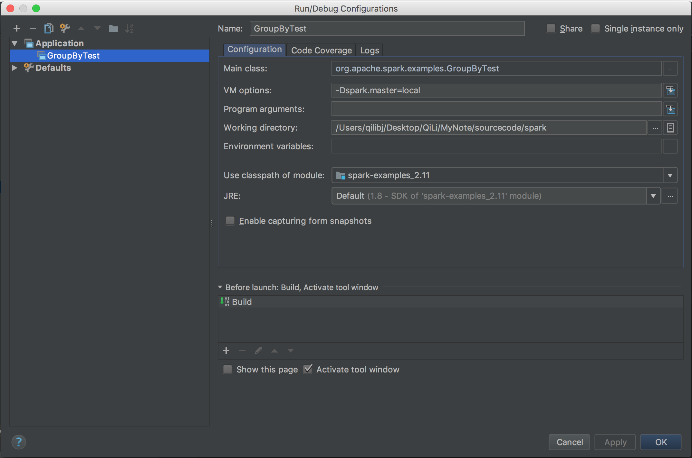

### Prerequisites

Compile and build Apache Spark source code by maven or SBT before import project into IDEA. Refer to the blog of [Compile Spark and Build Spark Package](https://qili93.github.io/Build-and-Compile-Spark/) for detailed steps.

Download and install the [Intellij IDEA Community Edition](https://www.jetbrains.com/idea/download/) and install Scala plug-in (need restart).

### Import Spark as a project into IDEA - SBT

1. Select `File -> Import Project` and choose the root directory of Spark source code
2. Select `Import project from external model -> SBT` and click `Next`
3. Check `Use auto-import` and then click `Finish`

(Optional) Wait a few hours for SBT to finishe and open `View -> Tool Windows -> Project`.

### Import Spark as a project into IDEA - Maven

Refer to [Useful Developer Tools](http://spark.apache.org/developer-tools.html) for more details.

While many of the Spark developers use SBT or Maven on the command line, the most common IDE we use is IntelliJ IDEA. You can get the community edition for free (Apache committers can get free IntelliJ Ultimate Edition licenses) and install the JetBrains Scala plugin from `Preferences > Plugins`.

To create a Spark project for IntelliJ:

- Go to `File -> Import Project`, locate the spark source directory, and select “Maven Project”.
- In the Import wizard, it’s fine to leave settings at their default. However it is usually useful to enable “Import Maven projects automatically”, since changes to the project structure will automatically update the IntelliJ project.
- As documented in [Building Spark](http://spark.apache.org/docs/latest/building-spark.html), some build configurations require specific profiles to be enabled. The same profiles that are enabled with `-P[profile name]` above may be enabled on the Profiles screen in the Import wizard. For example, if developing for Hadoop 2.4 with YARN support, enable profiles yarn and hadoop-2.4. These selections can be changed later by accessing the “Maven Projects” tool window from the View menu, and expanding the Profiles section.

*Note: Starting version 2.0, Spark is built with Scala 2.11 by default. Configure the Scala version in IDEA: `open File -> Project Structure -> Global Libraries` add `scala SDK 2.11`*

### Debug Spark source code in local mode

Refer to [Apache Spark源码走读之18 -- 使用Intellij idea调试Spark源码](http://www.cnblogs.com/hseagle/p/3850841.html) for more detailed info.

**Step 1:** go to `Build -> Build Projec` and wait serveral minutes to compile the Spark project. Open the `org.apache.spark.examples.GroupByTest` and go to `Run -> Edit Configurations`, edit the configuration as following, and notice the configurations of Main class, VM options, Working directory and Use classpath of module.

**Step 2:** try `Run -> Run GroupByTest` to ensure the sample can run successfully, and then set a breakpoint and got to `Run -> Debug GroupByTest` to debug Spark sourcec code in local mode.

### Fix build error

`Exception in thread "main" java.lang.NoClassDefFoundError: scala/collection/Seq`: 

Refer to http://blog.csdn.net/javastart/article/details/43372977