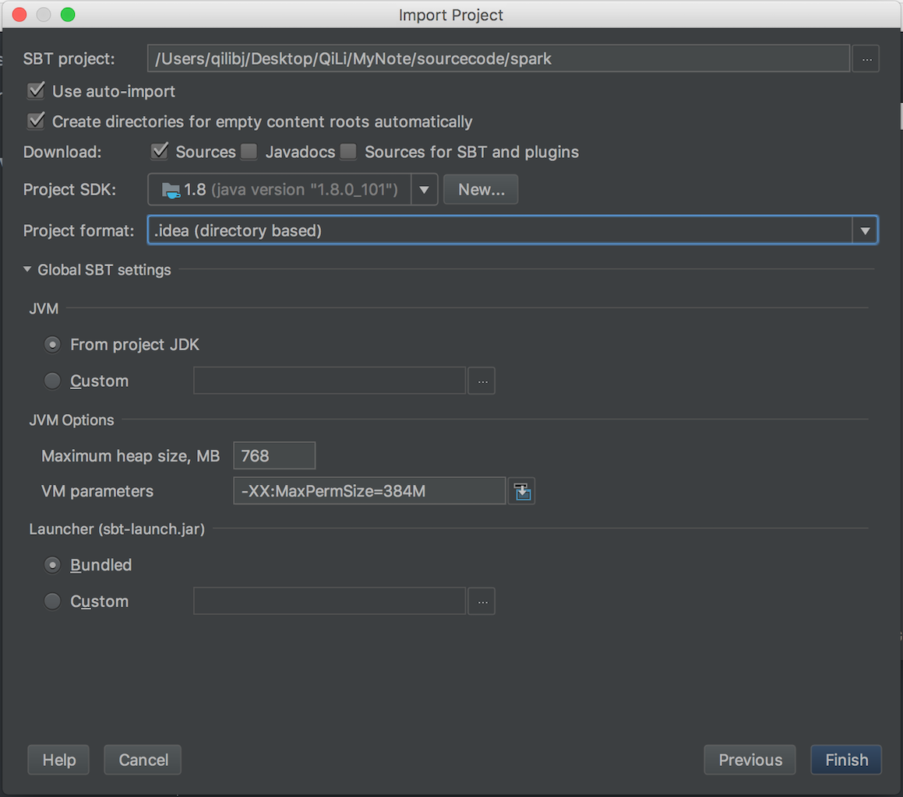

### Prerequisites

Compile and build Apache Spark source code by maven or execute `sbt clean` and `sbt assembly` before import project into IDEA. Refer to the blog of [Compile Spark and Build Spark Package](https://qili93.github.io/Build-and-Compile-Spark/) for detailed steps.

### Download and configure IntelliJ IDEA CE

Download and install the [Intellij IDEA Community Edition](https://www.jetbrains.com/idea/download/) and install Scala plug-in.

### Create a new project from Github

Open IDEA and select "Import Project". Select the directory of Apache Spark source code (compiled) and import as a SBT project, and waiting for IDEA to build (need a few hours to download SBT related jar files).

