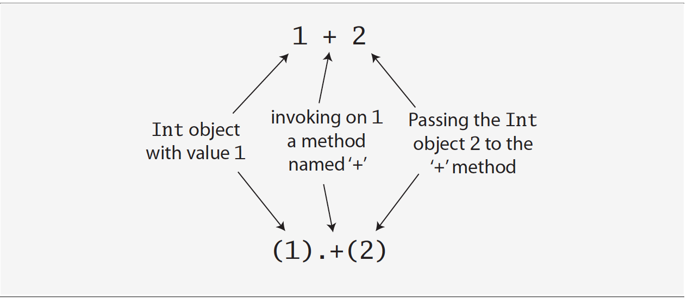
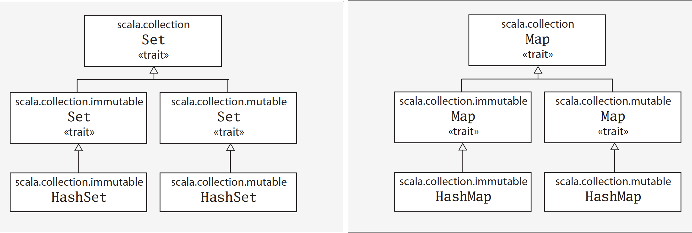

<!-- START doctoc generated TOC please keep comment here to allow auto update -->
<!-- DON'T EDIT THIS SECTION, INSTEAD RE-RUN doctoc TO UPDATE -->
**Table of Contents**  *generated with [DocToc](https://github.com/thlorenz/doctoc)*

- [Chapter 1: A Scalable Language](#chapter-1-a-scalable-language)
  - [What makes Scala scalable?](#what-makes-scala-scalable)
  - [Why Scala?](#why-scala)
- [Chapter 2: First Steps in Scala](#chapter-2-first-steps-in-scala)
  - [Step 1: Scala interpreter shell](#step-1-scala-interpreter-shell)
  - [Step 2: Define some variables](#step-2-define-some-variables)
  - [Step 3: Define some functions](#step-3-define-some-functions)
  - [Step 4: Write some Scala scripts](#step-4-write-some-scala-scripts)
  - [Step 5: Loop with *while* decide with *if*](#step-5-loop-with-while-decide-with-if)
  - [Step 6: Iterate with *foreach* and *for*](#step-6-iterate-with-foreach-and-for)
- [Chapter 3: Next Steps in Scala](#chapter-3-next-steps-in-scala)
  - [Step 7: Parameterize arrays with types](#step-7-parameterize-arrays-with-types)
  - [Step 8: Use lists](#step-8-use-lists)
  - [Step 9. Use tuples](#step-9-use-tuples)
  - [Step 10. Use sets and maps](#step-10-use-sets-and-maps)
  - [Step 11. Learn to recognize the functional style](#step-11-learn-to-recognize-the-functional-style)
  - [Step 12. Read lines from a file](#step-12-read-lines-from-a-file)

<!-- END doctoc generated TOC please keep comment here to allow auto update -->

### Chapter 1: A Scalable Language

#### What makes Scala scalable?

- Scala is an **object-oriented** language in pure form: every value is an object and every operation is a method call.
- Scala is **functional**, and functional programming is guided by two main ideas:
    1. The first idea is that functions are first-class values. In a functional language, a function is a value of the same status as, say, an integer or a string.
    2. The second main idea of functional programming is that the operations of a program should map input values to output values rather than change data in place, that is, data structures are immutable.

#### Why Scala?

1) Scala is **compatible**: Scala was designed for seamless in- teroperability with Java. It allows you to add value to existing code—to build on what you already have. (While the backward compatibility of Scala itself is not good).

2) Scala is **concise**. Scala programs tend to be short. Scala programmers have reported reduc- tions in number of lines of up to a factor of ten compared to Java. For example, in Java, a class with a constructor often looks like this:


  // this is Java
  class MyClass {
      private int index;
      private String name;
      public MyClass(int index, String name) {
          this.index = index;
          this.name = name;
} }


In Scala, you would likely write this instead:


  class MyClass(index: Int, name: String)


3) Scala is **high-level**. Scala helps you manage complexity by letting you raise the level of ab- straction in the interfaces you design and use. As an example, imagine you have a String variable name, and you want to find out whether or not that String contains an upper case character. In Java, you might write this:


  // this is Java
  boolean nameHasUpperCase = false;
  for (int i = 0; i < name.length(); ++i) {
      if (Character.isUpperCase(name.charAt(i))) {
          nameHasUpperCase = true;
          break;
} }


Whereas in Scala, you could write this:


  val nameHasUpperCase = name.exists(_.isUpperCase)


4) Scala is **statically typed**. A static type system classifies variables and expressions according to the kinds of values they hold and compute. Scala stands out as a language with a very advanced static type system. (**TBD: more background of static type and then read this section again**)

### Chapter 2: First Steps in Scala

#### Step 1: Scala interpreter shell

Type `scala` at a command prompt


$ scala
Welcome to Scala 2.11.8 (Java HotSpot(TM) 64-Bit Server VM, Java 1.8.0_121).
Type in expressions for evaluation. Or try :help.

scala> 1 + 2
res0: Int = 3


Type `:quit` to exit the scala interpreter shell


scala> :quit


#### Step 2: Define some variables

Scala has two kinds of variables, vals and vars.
- A `val` is similar to a **final** variable in Java. Once initialized, a val can never be reassigned.


scala> val msg = "Hello world!"
msg: String = Hello world!

scala> msg = "Goodbye world!"
<console>:12: error: reassignment to val
       msg = "Goodbye world!"
           ^


- A `var`, is similar to a **non-final** variable in Java. A var can be reassigned throughout its lifetime.


scala> var msg = "Hello world!"
msg: String = Hello world!

scala> msg = "Goodbye world!"
msg: String = Goodbye world!

scala> println(msg)
Goodbye world!


 
To enter something into the interpreter that spans multiple lines, just keep typing after the first line. If the code you typed so far is not complete, the interpreter will respond with a vertical bar on the next line.


scala> val multiLine =
     | "This is the next line."
multiLine: String = This is the next line.


If you realize you have typed something wrong, but the interpreter is still waiting for more input, you can escape by pressing enter twice:


scala> val oops =
     |
     |
You typed two blank lines.  Starting a new command.

scala>


#### Step 3: Define some functions

Scala’s Unit type is similar to Java’s void type, and in fact every void-returning method in Java is mapped to a Unit-returning method in Scala.


scala> def greet() = println("Hello, world!")
greet: ()Unit


#### Step 4: Write some Scala scripts

Put this into a file named `hello.scala` and then run:


$ echo 'println("Hello, "+ args(0) +"!")' > hello.scala
$ scala hello.scala world
Hello, world!


#### Step 5: Loop with *while* decide with *if*


var i = 0
while (i < args.length) {
    if (i != 0)
        print(" ")
    print(args(i))
i += 1
}
println()


#### Step 6: Iterate with *foreach* and *for*

Program in a functional style:


args.foreach(arg => println(arg))
args.foreach(println)
for (arg <- args)
    println(arg)


### Chapter 3: Next Steps in Scala

#### Step 7: Parameterize arrays with types

Scala doesn't technically have operator overloading, because it doesn't actually have operators in the traditional sense. Instead, characters such as +, -, *, and / can be used in method names. Thus, when you typed `1 + 2` into the Scala interpreter in Step 1, you were actually invoking a method named + on the Int object 1, passing in 2 as a parameter, you could alternatively have written `1 + 2` using traditional method invocation syntax, `(1).+(2)`.

Scala has fewer special cases than Java. Arrays are simply instances of classes like any other class in Scala. When you apply parentheses surrounding one or more values to a variable, Scala will transform the code into an invocation of a method named apply on that variable. So `greetStrings(i)` gets transformed into `greetStrings.apply(i)`. This principle is not restricted to arrays: any application of an object to some arguments in parentheses will be transformed to an `apply` method call. Of course this will compile only if that type of object actually defines an `apply` method.

Similarly, when an assignment is made to a variable to which parentheses and one or more arguments have been applied, the compiler will transform that into an invocation of an `update` method that takes the arguments in parentheses as well as the object to the right of the equals sign. For example:

`greetStrings(0) = "Hello"`

will be transformed into:

`greetStrings.update(0, "Hello")`

Scala provides a more concise way to create and initialize arrays that you would normally use.


val numNames = Array("zero", "one", "two")


#### Step 8: Use lists

For an immutable sequence of objects that share the same type you can use Scala's `List` class. As with arrays, a `List[String]` contains only strings. Scala's List, `scala.List`, differs from Javas `java.util.List` type in that Scala Lists are always immutable (whereas Java Lists can be mutable). More generally, Scala's `List` is designed to enable a functional style of programming.


val oneTwo = List(1, 2)
val threeFour = List(3, 4)
val oneTwoThree = 1 :: twoThree
val oneTwoThreeFour = oneTwo ::: threeFour


Note: If the method name ends in a colon, the method is invoked on the right operand. Therefore, in  `1 :: twoThree`, the :: method is invoked on twoThree, passing in 1, like this: `twoThree.::(1)`.

Given that a shorthand way to specify an empty list is `Nil`, one way to initialize new lists is to string together elements with the cons operator, with Nil as the last element.4 For example, the following script will produce the same output as the previous one, “List(1, 2, 3)”:


val oneTwoThree = 1 :: 2 :: 3 :: Nil


Some List methods and usages

| What it is                               | What it does                             |
| ---------------------------------------- | ---------------------------------------- |
| `List()` or `Nil`                        | The empty List                           |
| `List("Cool", "tools", "rule")`          | Creates a new List[String] with the three values "Cool", "tools", and "rule" |
| `val thrill = "Will" :: "fill" :: "until" :: Nil` | Creates a new List[String] with the three values "Will", "fill", and "until" |
| `List("a", "b") ::: List("c", "d")`      | Concatenates two lists (returns a new List[String] with values "a", "b", "c", and "d") |
| `thrill(2)`                              | Returns the element at index 2 (zero based) of the thrill list (returns "until") |
| `thrill.count(s => s.length == 4)`       | Counts the number of string elements in thrill that have length 4 (returns 2) |
| `thrill.drop(2)`                         | Returns the thrill list without its first 2 elements (returns List("until")) |
| `thrill.dropRight(2)`                    | Returns the thrill list without its rightmost 2 elements (returns List("Will")) |
| `thrill.exists(s => s == "until")`       | Determines whether a string element exists in thrill that has the value "until" (returns true) |
| `thrill.filter(s => s.length == 4)`      | Returns a list of all elements, in order, of the thrill list that have length 4 (returns List("Will", "fill")) |
| `thrill.forall(s => s.endsWith("l"))`    | Indicates whether all elements in the thrill list end with the letter "l" (returns true) |
| `thrill.foreach(s => print(s))`          | Executes the print statement on each of the strings in the thrill list (prints "Willfilluntil") |
| `thrill.foreach(print)`                  | Same as the previous, but more concise (also prints "Willfilluntil") |
| `thrill.head`                            | Returns the first element in the thrill list (returns "Will") |
| `thrill.init`                            | Returns a list of all but the last element in the thrill list (returns List("Will", "fill")) |
| `thrill.isEmpty`                         | Indicates whether the thrill list is empty (returns false) |
| `thrill.last`                            | Returns the last element in the thrill list (returns "until") |
| `thrill.length`                          | Returns the number of elements in the thrill list (returns 3) |
| `thrill.map(s => s + "y")`               | Returns a list resulting from adding a "y" to each string element in the thrill list (returns List("Willy", "filly", "untily")) |
| `thrill.mkString(", ")`                  | Makes a string with the elements of the list (returns "Will, fill, until") |
| `thrill.remove(s => s.length == 4)`      | Returns a list of all elements, in order, of the thrill list except those that have length 4 (returns List("until")) |
| `thrill.reverse`                         | Returns a list containing all elements of the thrill list in reverse order (returns List("until", "fill", "Will")) |
| `thrill.sort((s, t) => s.charAt(0).toLowerCase < t.charAt(0).toLowerCase)` | Returns a list containing all elements of the thrill list in alphabetical order of the first character lowercased (returns List("fill", "until", "Will")) |
| `thrill.tail`                            | Returns the thrill list minus its first element (returns List("fill", "until")) |

#### Step 9. Use tuples

Another useful container object is the `tuple`. Like lists, tuples are immutable, but unlike lists, tuples can contain different types of elements.


val pair = (99, "Luftballons")
println(pair._1)
println(pair._2)


The actual type of a tuple depends on the number of elements it contains and the types of those elements. Thus, the type of `(99, "Luftballons")` is `Tuple2[Int, String]`. The type of `('u', 'r', "the", 1, 4, "me")` is `Tuple6[Char, Char, String, Int, Int, String]`.

> **Note**: you may be wondering why you can’t access the elements of a tuple like the elements of a list, for example, with “pair(0)”. The reason is that a list’s apply method always returns the same type, but each element of a tuple may be a different type: _1 can have one result type, _2 another, and so on. These _N numbers are one-based, instead of zerobased, because starting with 1 is a tradition set by other languages with statically typed tuples, such as Haskell and ML.

#### Step 10. Use sets and maps

`Array`s are always mutable, whereas `list`s are always immutable. When it comes to sets and maps, Scala also provides mutable and immutable alternatives, but in a different way. For sets and maps, Scala models mutability in the class hierarchy.

To add a new element to a set, you call + on the set, passing in the new element. Both mutable and immutable sets offer a + method, but their behavior differs. Whereas a mutable set will add the element to itself, an immutable set will create and return a new set with the element added.

Create an immutable Set


var jetSet = Set("Boeing", "Airbus")
jetSet += "Lear"
println(jetSet.contains("Cessna"))


Create a mmutable Set


import scala.collection.mutable.Set
val movieSet = Set("Hitch", "Poltergeist")
movieSet += "Shrek"
println(movieSet)


Create an immutable HashSet


import scala.collection.immutable.HashSet
val hashSet = HashSet("Tomatoes", "Chilies")
println(hashSet + "Coriander")


Create a mmutable Map


import scala.collection.mutable.Map
val treasureMap = Map[Int, String]()
treasureMap += (1 -> "Go to island.")
treasureMap += (2 -> "Find big X on ground.")
treasureMap += (3 -> "Dig.")
println(treasureMap(2))


Create an immutable Map


val romanNumeral = Map(
  1 -> "I", 2 -> "II", 3 -> "III", 4 -> "IV", 5 -> "V"
)
println(romanNumeral(4))


#### Step 11. Learn to recognize the functional style

The first step is to recognize the difference between the two styles in code. One telltale sign is that if code contains any `vars`, it is probably in an imperative style. If the code contains no `vars` at all—i.e., it contains only `vals`—it is probably in a functional style. One way to move towards a functional style, therefore, is to try to program without `vars`.

Use a `var` and is therefore in the imperative style:


def printArgs(args: Array[String]): Unit = {
  var i = 0
  while (i < args.length) {
    println(args(i))
    i += 1
  }
}


Transform this bit of code into a more functional style by getting rid of the `var`,


def printArgs(args: Array[String]): Unit = {
  for (arg <- args)
  println(arg)
}


or programming with fewer vars


def printArgs(args: Array[String]): Unit = {
args.foreach(println)
}


The refactored printArgs method is not purely functional, because it has side effects—in this case, its side effect is printing to the standard output stream. The telltale sign of a function with side effects is that its result type is Unit. If a function isn’t returning any interesting value, which is what a result type of Unit means, the only way that function can make a difference in the world is through some kind of side effect. A more functional approach would be to define a method that formats the passed args for printing, but just returns the formatted string, as shown below


def formatArgs(args: Array[String]) = args.mkString("\n")


Now you're really functional: no side effects or vars in sight. Of course, this function doesn’t actually print anything out like the printArgs methods did, but you can easily pass its
result to println to accomplish that:


println(formatArgs(args))


Every useful program is likely to have side effects of some form, because otherwise it wouldn't be able to provide value to the outside world. Preferring methods without side effects encourages you to design programs where side-effecting code is minimized. One benefit of this approach is that it can help make your programs easier to test. For example, to test any of the three printArgs methods shown earlier in this section, you'd need to redefine println, capture the output passed to it, and make sure it is what you expect. By contrast, you could test formatArgs simply by checking its result:


  val res = formatArgs(Array("zero", "one", "two"))
  assert(res == "zero\none\ntwo")


> **A balanced attitude for Scala programmers**:
> Prefer vals, immutable objects, and methods without side effects. Reach for them first. Use vars, mutable objects, and methods with side effects when you have a specific need and justification for them.

#### Step 12. Read lines from a file


import scala.io.Source
  if (args.length > 0) {
    for (line <- Source.fromFile(args(0)).getLines)
      print(line.length +" "+ line)
}
else
Console.err.println("Please enter filename")


You may wish to line up the numbers, right adjusted, and add a pipe character, so that the output looks instead like:


23 | import scala.io.Source
1  |
23 | if (args.length > 0) {
1  |
50 | for (line <- Source.fromFile(args(0)).getLines)
34 |   print(line.length +" "+ line)
2  | }
5  | else
47 |   Console.err.println("Please enter filename")


The following is the script. The `reduceLeft` method applies the passed function to the first two elements in lines, then applies it to the result of the first application and the next element in lines, and so on, all the way through the list.


import scala.io.Source
def widthOfLength(s: String) = s.length.toString.length
if (args.length > 0) {
  val lines = Source.fromFile(args(0)).getLines.toList
  /*
  def widthOfLength(s: String) = s.length.toString.length
  var maxWidth = 0
  for (line <- lines)
  maxWidth = maxWidth.max(widthOfLength(line))
   */
  val longestLine = lines.reduceLeft(
  (a, b) => if (a.length > b.length) a else b
  )
  val maxWidth = widthOfLength(longestLine)
  for (line <- lines) {
    val numSpaces = maxWidth - widthOfLength(line)
    val padding = " " * numSpaces
    print(padding + line.length +" | "+ line)
  }
}
else
  Console.err.println("Please enter filename")
