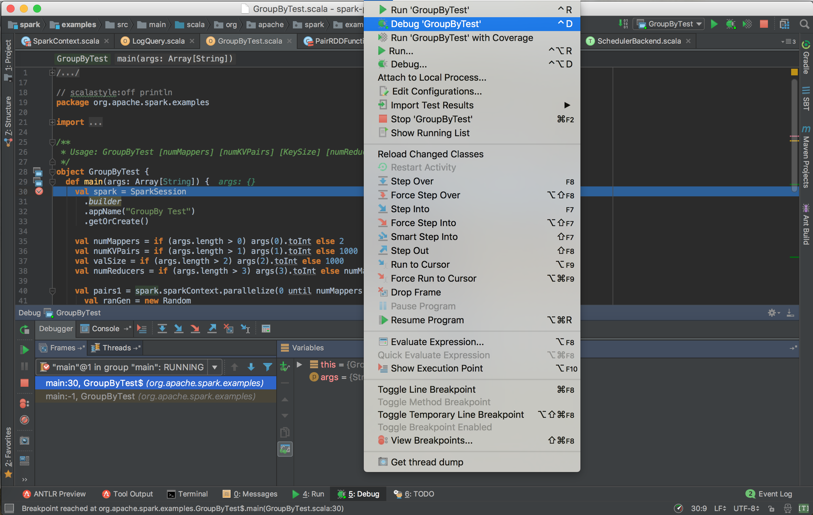

<!-- START doctoc generated TOC please keep comment here to allow auto update -->
<!-- DON'T EDIT THIS SECTION, INSTEAD RE-RUN doctoc TO UPDATE -->

<!-- END doctoc generated TOC please keep comment here to allow auto update -->

### Chapter 1: 走进Java

#### Java技术体系


args.foreach(arg => println(arg))
args.foreach(println)
for (arg <- args)
    println(arg)


### Chapter 3: Next Steps in Scala