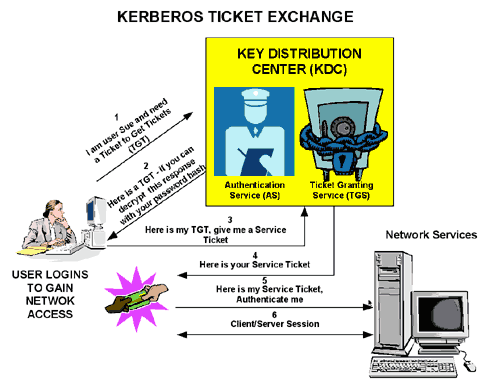
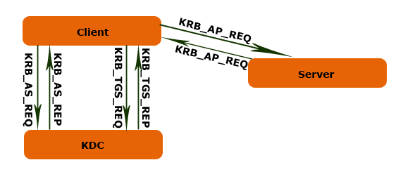
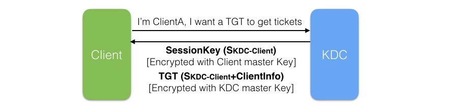
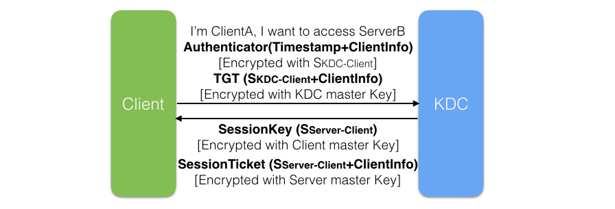
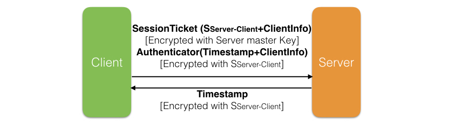
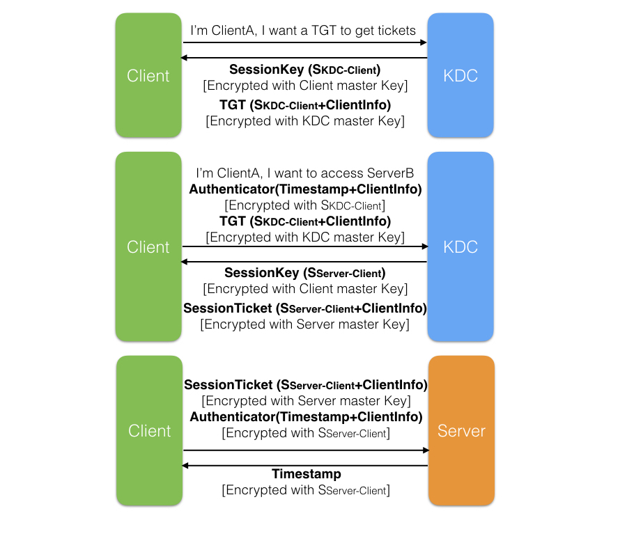
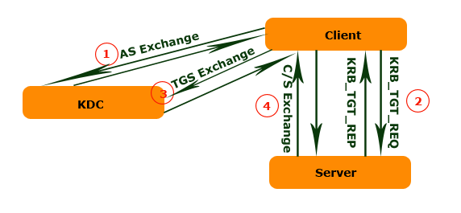
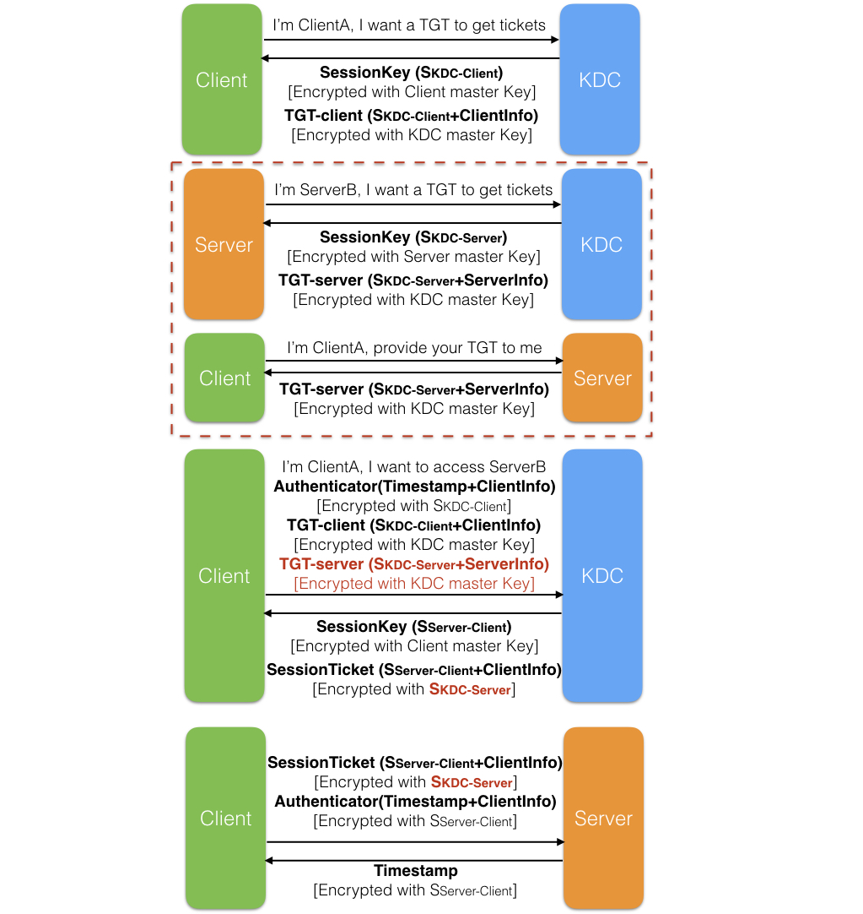

<!-- START doctoc generated TOC please keep comment here to allow auto update -->
<!-- DON'T EDIT THIS SECTION, INSTEAD RE-RUN doctoc TO UPDATE -->
**Table of Contents**  *generated with [DocToc](https://github.com/thlorenz/doctoc)*

- [1. Authentication Service Exchange](#1-authentication-service-exchange)
- [2. Ticket Granting Service Exchange](#2-ticket-granting-service-exchange)
- [3. Client/Server Exchange](#3-clientserver-exchange)
  - [为何要用Timestamp](#%E4%B8%BA%E4%BD%95%E8%A6%81%E7%94%A8timestamp)
  - [双向认证（Mutual Authentication）](#%E5%8F%8C%E5%90%91%E8%AE%A4%E8%AF%81mutual-authentication)
- [User2User Sub-Protocol：有效地保障Server的安全](#user2user-sub-protocol%E6%9C%89%E6%95%88%E5%9C%B0%E4%BF%9D%E9%9A%9Cserver%E7%9A%84%E5%AE%89%E5%85%A8)
- [Kerberos的优点](#kerberos%E7%9A%84%E4%BC%98%E7%82%B9)
- [参考文章](#%E5%8F%82%E8%80%83%E6%96%87%E7%AB%A0)

<!-- END doctoc generated TOC please keep comment here to allow auto update -->

Kerberos起源于希腊神话，是一支守护着冥界长着3个头颅的神犬，Kerberos的3个头颅分别代表：KDC(Kerberos Distribution Center)，Client和Server。KDC作为domain controller，主要提供两种服务： Authentication Service (AS) 和 Ticket-Granting Service (TGS)。

KDC在整个Kerberos Authentication中作为Client和Server共同信任的第三方起着重要的作用，而Kerberos的认证过程就是通过这3方协作完成。对于一个Windows Domain来说，Domain Controller扮演着KDC的角色。KDC维护着一个存储着该Domain中所有帐户的Account Database（一般地，这个Account Database由AD来维护），也就是说，他知道属于每个Account的名称和派生于该Account Password的Master Key。

当Client需要初始访问一个Sever的时候，需要进行Kerberos整个认证过程通过3个sub-protocol来完成。这个3个Sub-Protocol分别为:

1. Authentication Service Exchange (AS Exchange)
2. Ticket Granting Service Exchange (TGS Exchange)
3. Client/Server Exchange (CS Exchange)

### 1. Authentication Service Exchange

通过这个Sub-protocol，KDC中的Authentication Service实现对Client身份的确认，并颁发给该Client一个TGT。具体过程如下：

Client向KDC的Authentication Service发送Authentication Service Request（KRB_AS_REQ）, 为了确保KRB_AS_REQ仅限于自己和KDC知道，Client使用自己的Master Key对KRB_AS_REQ的主体部分进行加密（KDC可以通过Domain 的Account Database获得该Client的Master Key）。KRB_AS_REQ的大体包含以下的内容：

- Pre-authentication data：包含用以证明自己身份的信息。说白了，就是证明自己知道自己声称的那个account的Password。一般地，它的内容是一个被Client的Master key加密过的Timestamp。
- Client name & realm: 简单地说就是Domain name\Client
- Server Name：注意这里的Server Name并不是Client真正要访问的Server的名称，而我们也说了TGT是和Server无关的（Client只能使用Ticket，而不是TGT去访问Server）。这里的Server Name实际上是**KDC的Ticket Granting Service的Server Name**。

AS（Authentication Service）通过它接收到的KRB_AS_REQ验证发送方的是否是在Client name & realm中声称的那个人，也就是说要验证发送放是否知道Client的Password。所以AS只需从Account Database中提取Client对应的Master Key对Pre-authentication data进行解密，如果是一个合法的Timestamp，则可以证明发送放提供的是正确无误的密码。验证通过之后，AS将一份Authentication Service Response（KRB_AS_REP）发送给Client。KRB_AS_REQ主要包含两个部分：本Client的Master Key加密过的**Session Key（SKDC-Client：Logon Session Key）**和被自己（KDC）加密的**TGT**。而TGT大体又包含以下的内容：

- Session Key: SKDC-Client：Logon Session Key
- Client name & realm: 简单地说就是Domain name\Client
- End time: TGT到期的时间。

Client通过自己的Master Key对第一部分解密获得Session Key（SKDC-Client：Logon Session Key）之后，携带着TGT便可以进入下一步：TGS（Ticket Granting Service）Exchange。

### 2. Ticket Granting Service Exchange

TGS（Ticket Granting Service）Exchange通过Client向KDC中的TGS（Ticket Granting Service）发送Ticket Granting Service Request（KRB_TGS_REQ）开始。KRB_TGS_REQ大体包含以下的内容：

- TGT：Client通过AS Exchange获得的Ticket Granting Ticket，TGT被KDC的Master Key进行加密。
- Authenticator：用以证明当初TGT的拥有者是否就是自己，所以它必须以TGT的颁发方（KDC）和自己（Client）的Session Key（SKDC-Client：Logon Session Key）来进行加密。
- Client name & realm: 简单地说就是Domain name\Client。
- Server name & realm: 简单地说就是Domain name\Server，这回是Client试图访问的那个Server。

TGS收到KRB_TGS_REQ在发给Client真正的Ticket之前，先得整个Client提供的那个TGT是否是AS颁发给它的。于是它不得不通过Client提供的Authenticator来证明。但是Authentication是通过Logon Session Key（SKDC-Client）进行加密的，而自己并没有保存这个Session Key。所以TGS先得通过自己的Master Key对Client提供的TGT进行解密，从而获得这个Logon Session Key（SKDC-Client），再通过这个Logon Session Key（SKDC-Client）解密Authenticator进行验证。验证通过向对方发送Ticket Granting Service Response（KRB_TGS_REP）。这个KRB_TGS_REP有两部分组成：使用Logon Session Key（SKDC-Client）加密过用于Client和Server的Session Key（SServer-Client）和使用Server的Master Key进行加密的Ticket。该Ticket大体包含以下一些内容：

- Session Key：SServer-Client。
- Client name & realm: 简单地说就是Domain name\Client。
- End time: Ticket的到期时间。

Client收到KRB_TGS_REP，使用Logon Session Key（SKDC-Client）解密第一部分后获得Session Key（SServer-Client）。有了Session Key和Ticket，Client就可以之间和Server进行交互，而无须在通过KDC作中间人了。所以我们说Kerberos是一种高效的认证方式，它可以直接通过Client和Server双方来完成，不像Windows NT 4下的NTLM认证方式，每次认证都要通过一个双方信任的第3方来完成。

#### Authenticator - 为有效的证明自己提供证据

通过上面的过程，Client实际上获得了两组信息：一个通过自己Master Key加密的Session Key，另一个被Sever的Master Key加密的数据包，包含Session Key和关于自己的一些确认信息。一般而言，只要通过一个双方知晓的Key就可以对对方进行有效的认证，但是在一个网络的环境中，这种简单的做法是具有安全漏洞，为此,Client需要提供更多的证明信息，我们把这种证明信息称为Authenticator，在Kerberos的Authenticator实际上就是**关于Client的一些信息和当前时间的一个Timestamp**。

### 3. Client/Server Exchange

Client通过TGS Exchange获得Client和Server的Session Key（SServer-Client），随后创建用于证明自己就是Ticket的真正所有者的Authenticator，并使用Session Key（SServer-Client）进行加密。最后将这个被加密过的Authenticator和Ticket作为Application Service Request（KRB_AP_REQ）发送给Server。除了上述两项内容之外，KRB_AP_REQ还包含一个Flag用于表示Client是否需要进行双向验证（Mutual Authentication）。

Server接收到KRB_AP_REQ之后，通过自己的Master Key解密Ticket，从而获得Session Key（SServer-Client）。通过Session Key（SServer-Client）解密Authenticator，进而验证对方的身份。验证成功，让Client访问需要访问的资源，否则直接拒绝对方的请求。

对于需要进行双向验证，Server从Authenticator提取Timestamp，使用Session Key（SServer-Client）进行加密，并将其发送给Client用于Client验证Server的身份。

#### 为何要用Timestamp

我们试想这样的现象：Client向Server发送的数据包被某个恶意网络监听者截获，该监听者随后将数据包座位自己的Credential冒充该Client对Server进行访问，在这种情况下，依然可以很顺利地获得Server的成功认证。为了解决这个问题，Client在Authenticator中会加入一个当前时间的Timestamp。

在Server对Authenticator中的Client Info和Session Ticket中的Client Info进行比较之前，会先提取Authenticator中的Timestamp，并同当前的时间进行比较，如果他们之间的偏差超出一个可以接受的时间范围（一般是5mins），Server会直接拒绝该Client的请求。在这里需要知道的是，Server维护着一个列表，这个列表记录着在这个可接受的时间范围内所有进行认证的Client和认证的时间。对于时间偏差在这个可接受的范围中的Client，Server会从这个这个列表中获得最近一个该Client的认证时间，只有当Authenticator中的Timestamp晚于通过一个Client的最近的认证时间的情况下，Server采用进行后续的认证流程。

#### 双向认证（Mutual Authentication）

Kerberos一个重要的优势在于它能够提供双向认证：不但Server可以对Client 进行认证，Client也能对Server进行认证。

具体过程是这样的，如果Client需要对他访问的Server进行认证，会在它向Server发送的Credential中设置一个是否需要认证的Flag。Server在对Client认证成功之后，会把Authenticator中的Timestamp提出出来，通过Session Key进行加密，当Client接收到并使用Session Key进行解密之后，如果确认Timestamp和原来的完全一致，那么他可以认定Server正式他试图访问的Server。

那么为什么Server不直接把通过Session Key进行加密的Authenticator原样发送给Client，而要把Timestamp提取出来加密发送给Client呢？原因在于防止恶意的监听者通过获取的Client发送的Authenticator冒充Server获得Client的认证。

### User2User Sub-Protocol：有效地保障Server的安全

先引入两个重要概念：

> - **Long-term Key/Master Key**：在Security的领域中，有的Key可能长期内保持不变，比如你在密码，可能几年都不曾改变，这样的Key、以及由此派生的Key被称为Long-term Key。对于Long-term Key的使用有这样的原则：被Long-term Key加密的数据不应该在网络上传输。原因很简单，一旦这些被Long-term Key加密的数据包被恶意的网络监听者截获，在原则上，只要有充足的时间，他是可以通过计算获得你用于加密的Long-term Key的——任何加密算法都不可能做到绝对保密。
> - 在一般情况下，对于一个Account来说，密码往往仅仅限于该Account的所有者知晓，甚至对于任何Domain的Administrator，密码仍然应该是保密的。但是密码却又是证明身份的凭据，所以必须通过基于你密码的派生的信息来证明用户的真实身份，在这种情况下，一般将你的密码进行Hash运算得到一个Hash code, 我们一般管这样的Hash Code叫做Master Key。由于Hash Algorithm是不可逆的，同时保证密码和Master Key是一一对应的，这样既保证了你密码的保密性，有同时保证你的Master Key和密码本身在证明你身份的时候具有相同的效力。
> - **Short-term Key/Session Key**：由于被Long-term Key加密的数据包不能用于网络传送，所以我们使用另一种Short-term Key来加密需要进行网络传输的数据。由于这种Key只在一段时间内有效，即使被加密的数据包被黑客截获，等他把Key计算出来的时候，这个Key早就已经过期了。

基于3个Sub-protocol的Kerberos作为一种Network Authentication是具有它自己的局限和安全隐患的。**以某个Entity的Long-term Key加密的数据不应该在网络中传递**。原因很简单，所有的加密算法都不能保证100%的安全，对加密的数据进行解密只是一个时间的过程，最大限度地提供安全保障的做法就是：使用一个Short-term key（Session Key）代替Long-term Key对数据进行加密，使得恶意用户对其解密获得加密的Key时，该Key早已失效。但是对于3个Sub-Protocol的C/S Exchange，Client携带的Ticket却是被Server Master Key进行加密的，这显现不符合我们提出的原则，降低Server的安全系数。

所以我们必须寻求一种解决方案来解决上面的问题。这个解决方案很明显：就是采用一个Short-term的Session Key，而不是Server Master Key对Ticket进行加密。这就是我们今天要介绍的Kerberos的第4个Sub-protocol：User2User Protocol。我们知道，既然是Session Key，仅必然涉及到两方，而在Kerberos整个认证过程涉及到3方：Client、Server和KDC，所以用于加密Ticket的只可能是Server和KDC之间的Session Key（SKDC-Server）。

我们知道Client通过在AS Exchange阶段获得的TGT从KDC那么获得访问Server的Ticket。原来的Ticket是通过Server的Master Key进行加密的，而这个Master Key可以通过Account Database获得。但是现在KDC需要使用Server和KDC之间的SKDC-Server进行加密，而KDC是不会维护这个Session Key，所以这个Session Key只能靠申请Ticket的Client提供。所以在AS Exchange和TGS Exchange之间，Client还得对Server进行请求已获得Server和KDC之间的Session Key（SKDC-Server）。而对于Server来说，它可以像Client一样通过AS Exchange获得他和KDC之间的Session Key（SKDC-Server）和一个封装了这个Session Key并被KDC的Master Key进行加密的TGT，一旦获得这个TGT，Server会缓存它，以待Client对它的请求。我们现在来详细地讨论这一过程。

上图基本上翻译了基于User2User的认证过程，这个过程由4个步骤组成。我们发现较之我在上面一节介绍的基于传统3个Sub-protocol的认证过程，这次对了第2部。我们从头到尾简单地过一遍：

1. AS Exchange：Client通过此过程获得了属于自己的TGT，有了此TGT，Client可凭此向KDC申请用于访问某个Server的Ticket。
2. 这一步的主要任务是获得封装了Server和KDC的Session Key（SKDC-Server）的属于Server的TGT。如果该TGT存在于Server的缓存中，则Server会直接将其返回给Client。否则通过AS Exchange从KDC获取。
3. TGS Exchange：Client通过向KDC提供自己的TGT，Server的TGT以及Authenticator向KDC申请用于访问Server的Ticket。KDC使用先用自己的Master Key解密Client的TGT获得SKDC-Client，通过SKDC-Client解密Authenticator验证发送者是否是TGT的真正拥有者，验证通过再用自己的Master Key解密Server的TGT获得KDC和Server 的Session Key（SKDC-Server），并用该Session Key加密Ticket返回给Client。
4. C/S Exchange：Client携带者通过KDC和Server 的Session Key（SKDC-Server）进行加密的Ticket和通过Client和Server的Session Key（SServer-Client）的Authenticator访问Server，Server通过SKDC-Server解密Ticket获得SServer-Client，通过SServer-Client解密Authenticator实现对Client的验证。

### Kerberos的优点

分析整个Kerberos的认证过程之后，我们来总结一下Kerberos都有哪些优点：

1．较高的Performance

虽然我们一再地说Kerberos是一个涉及到3方的认证过程：Client、Server、KDC。但是一旦Client获得用过访问某个Server的Ticket，该Server就能根据这个Ticket实现对Client的验证，而无须KDC的再次参与。和传统的基于Windows NT 4.0的每个完全依赖Trusted Third Party的NTLM比较，具有较大的性能提升。

2．实现了双向验证（Mutual Authentication）

传统的NTLM认证基于这样一个前提：Client访问的远程的Service是可信的、无需对于进行验证，所以NTLM不曾提供双向验证的功能。这显然有点理想主义，为此Kerberos弥补了这个不足：Client在访问Server的资源之前，可以要求对Server的身份执行认证。

3．对Delegation的支持

Impersonation和Delegation是一个分布式环境中两个重要的功能。Impersonation允许Server在本地使用Logon 的Account执行某些操作，Delegation需用Server将logon的Account带入到另过一个Context执行相应的操作。NTLM仅对Impersonation提供支持，而Kerberos通过一种双向的、可传递的（Mutual 、Transitive）信任模式实现了对Delegation的支持。

4．互操作性（Interoperability）

Kerberos最初由MIT首创，现在已经成为一行被广泛接受的标准。所以对于不同的平台可以进行广泛的互操作。

### 参考文章
1. [Kerberos认证原理](http://blog.csdn.net/wulantian/article/details/42418231)
2. [Kerberos Explained](https://msdn.microsoft.com/en-us/library/bb742516.aspx)