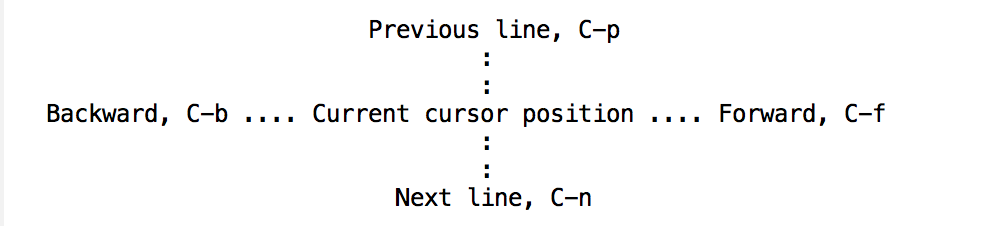

<!-- START doctoc generated TOC please keep comment here to allow auto update -->
<!-- DON'T EDIT THIS SECTION, INSTEAD RE-RUN doctoc TO UPDATE -->
**Table of Contents**  *generated with [DocToc](https://github.com/thlorenz/doctoc)*

<!-- END doctoc generated TOC please keep comment here to allow auto update -->

### Emacs Keys

- Meta = Option
- Ctrl = Ctrl

### Emacs Commands

#### Basic Commands

| Commands                   | Meaning                                  |
| -------------------------- | ---------------------------------------- |
| C-x C-c.  (Two characters) | End the Emacs session                    |
| C-g                        | To quit a partially entered command      |
| C-v                        | Move forward one screen                  |
| M-v                        | Move backward one screen                 |
| C-L                        | Clear screen and redisplay to move the text around the cursor to the center of the screen. |

#### Commands to review

| Commands | Meaning                            |
| -------- | ---------------------------------- |
| C-f      | Move forward a character           |
| C-b      | Move backward a character          |
| M-f      | Move forward a word                |
| M-b      | Move backward a word               |
| C-n      | Move to next line                  |
| C-p      | Move to previous line              |
| C-a      | Move to beginning of line          |
| C-e      | Move to end of line                |
| M-a      | Move back to beginning of sentence |
| M-e      | Move forward to end of sentence    |